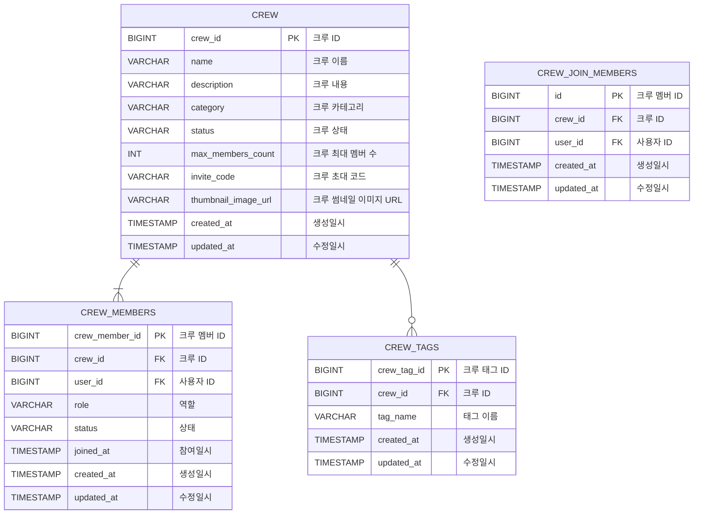

# Crew 도메인 설계
> Generated by [`🚀 groom-be`](https://github.com/orgs/groom-link/teams/groom-be)
## ERD 작성

## 상태 및 타입 정의 (Status & Type)

### category (CREW.category) - 크루 카테고리

| Type      | Description |
|-----------|-------------|
| TECH      | 기술 관련 크루    |
| DESIGN    | 디자인 관련 크루   |
| COMMUNITY | 커뮤니티 관련 크루  |
| OTHER     | 기타 크루       |

> 유동성이 있는 값으로, 필요에 따라 추가될 수 있습니다.

### status (CREW.status) - 크루 상태 

| Type     | Description |
|----------|-------------|
| READY    | 모임 오픈 대기    |
| OPEN     | 모임 오픈       |
| PROGRESS | 모임 진행 중     |
| CLOSED   | 모임 종료       |

### role (CREW_MEMBERS.role) - 크루 멤버 역할

| Type   | Description |
|--------|-------------|
| LEADER | 크루 리더       |
| MEMBER | 크루 일반 멤버    |

### status (CREW_MEMBERS.status) - 크루 멤버 상태

| Type   | Description |
|--------|-------------|
| JOINED | 참여 중        |
| LEFT   | 나가기         |
| KICKED | 강제 퇴장       |
