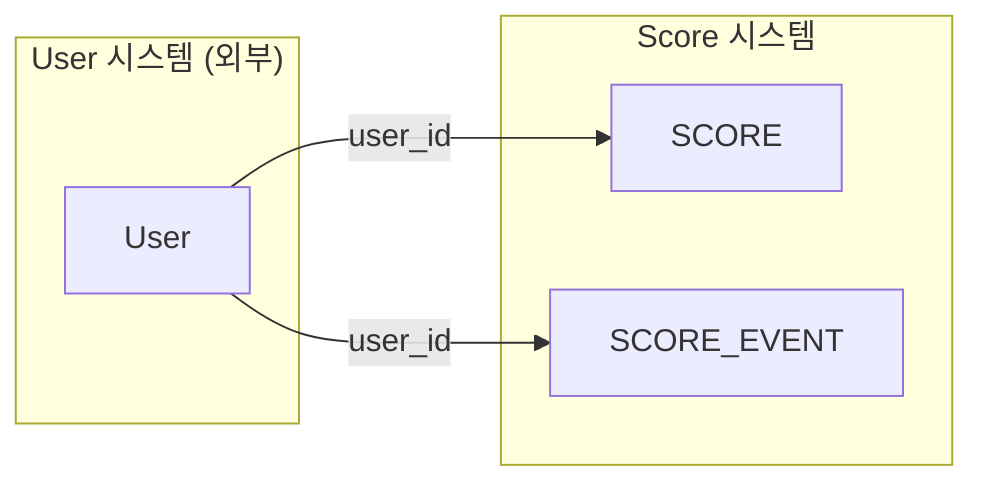
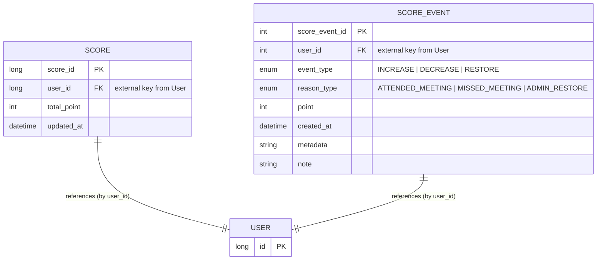

# ☀️ 맑음지수 (`Score`) 도메인
> Generated by [`🚀 groom-be`](https://github.com/orgs/groom-link/teams/groom-be)

 

## 📌 핵심기능정의
#### 점수 조회 : `user_id` 이용 점수를 조회한다.
#### 점수 변경(`증가` / `차감` / `복원`) : `user_id`, `amount` 이용 점수를 변경한다.
#### 점수 변경 이력 조회 : `user_id` 이용 점수 변경 이력을 조회한다.
#### 점수 변경 이력 기록 : `user_id`, `amount` 점수 변경 이력을 기록한다.

 

## 🤔 고려사항
#### 점수 `상한` / `하한` : 점수 인플레이션 방지.
#### 여러개의 점수 가능성 : `맑음지수` 이외의 점수 기능을 넣을 것 인지 ?
#### 점수의 유효기간 : 시간이 갈수록 점수가 기본점수로 감쇠함.
#### `SCORE_EVENT` 집계 기능 향상을 위한 다른 아이디어.

 

## 🎨 ERD

---

## ✅ 상태 및 타입 정의 (Status & Type)
### event_type (SCORE_EVENT.event_type) - 점수 이벤트 상태
| Type | Description|
| --- | --- |
| INCREASE | 증가 |
| DECREASE | 감소 |
| RESTORE | 복원 |

### reason_type (SCORE_EVENT.reason_type) - 점수 이벤트 발생 이유
> 💡 `점수 이벤트 발생 이유`는 향후 application이 발전함에 따라 코드 테이블로 분리 등을 고려해볼 필요가 있어보임
#### 🟢 증가 유형 `INCREASE`
| Type | Description|
| --- | --- |
| ATTENDED_MEETING | 모임 정상 참석 |
| HOSTED_MEETING | 모임 주최 성공 |
| REPORTED_BUG | 시스템 피드백/버그 제보 |
| RECEIVED_KARMA | 다른 사용자로부터의 긍정 평가 |

#### 🔴 감소 유형 `DECREASE`
| Type | Description|
| --- | --- |
| MISSED_MEETING | 모임 무단 불참 |
| MANUAL_DEDUCTION | 관리자 수동 차감 |
| REPORTED_BY_OTHERS | 타인 신고로 인한 감점 |
| TOXIC_BEHAVIOR | 악성 행위 적발 |

#### 🔁 복원 유형 `RESTORE`
| Type | Description|
| --- | --- |
| ADMIN_RESTORE | 관리자에 의한 복구 |
| MEETING_CANCELLED | 모임 자체가 취소되어 참석 처리 무효 |
| BUG_REVERTED | 시스템 오류로 인한 롤백 |