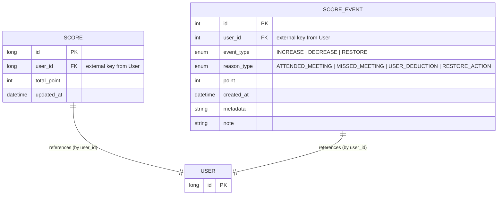
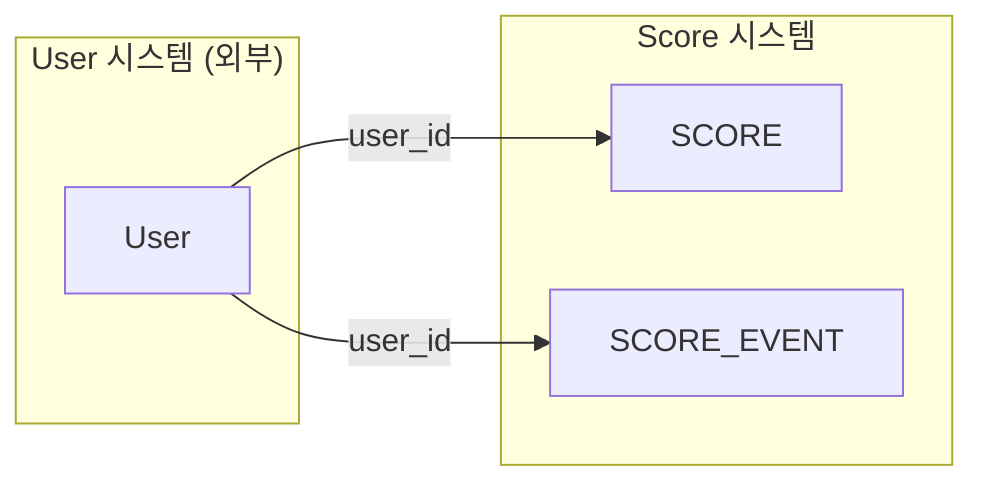

# 📈 Score
> Generated by [`🚀 groom-be`](https://github.com/orgs/groom-link/teams/groom-be)

 

## 📌 핵심기능정의
### 점수 조회
### 점수 증가 
### 점수 차감 
### 점수 복원
### 점수 이력 기록

 

## 🤔 고려사항
### 정합성
### 이력추적
### 읽기성능
### 쓰기성능
### 트랜잭션 관리
### 장애복구

 

## ☑️ 선택적 고려사항
### 점수 상한/하한
### 여러개의 점수 가능성
### 점수의 유효기간

 

## ⚠️ 자주 발생하는 이슈
### 동시성 충돌
### 점수증감 중복처리
### 예외상황 처리
### 관리자 수동 조정
### 통계 성능

 

## 🎨 ERD

---

