# ☀️ 맑음지수 (`Score`) 도메인
> Generated by [`🚀 groom-be`](https://github.com/orgs/groom-link/teams/groom-be)

 

## 📌 핵심기능정의
#### 점수 조회 : `user_id` 이용 점수를 조회한다.
#### 점수 변경(`증가` / `차감` / `복원`) : `user_id`, `amount` 이용 점수를 변경한다.
#### 점수 변경 이력 조회 : `user_id` 이용 점수 변경 이력을 조회한다.
#### 점수 변경 이력 기록 : `user_id`, `amount` 점수 변경 이력을 기록한다.

 

## 🤔 고려사항
#### 정합성
#### 이력추적
#### 읽기성능
#### 쓰기성능
#### 트랜잭션 관리
#### 장애복구

 

## ☑️ 선택적 고려사항
#### 점수 `상한` / `하한` : 점수 인플레이션 방지.
#### 여러개의 점수 가능성 : `맑음지수` 이외의 점수 기능을 넣을 것 인지 ?
#### 점수의 유효기간 : 시간이 갈수록 점수가 기본점수로 감쇠함.

 

## ⚠️ 자주 발생하는 이슈
#### 동시성 충돌
#### 점수증감 중복처리
#### 예외상황 처리
#### 관리자 수동 조정
#### 통계 성능

 

## 🎨 ERD

```mermaid
flowchart LR
    subgraph "User 시스템 (외부)"
        U[User]
    end

    subgraph "Score 시스템"
        S[SCORE]
        E[SCORE_EVENT]
    end

    U -->|user_id| S
    U -->|user_id| E
```

---
